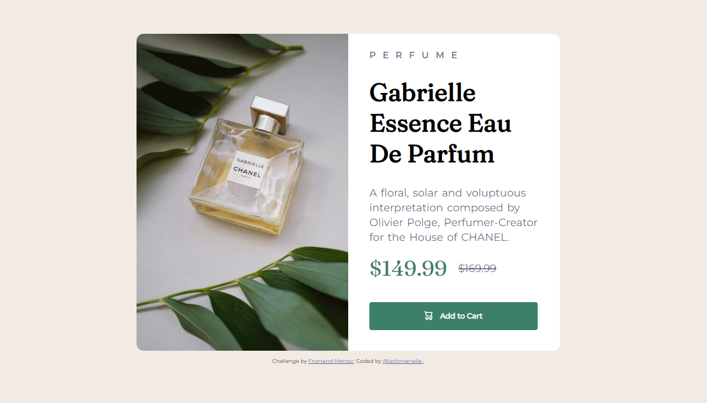

# Frontend Mentor - Product preview card component solution

This is a solution to the [Product preview card component challenge on Frontend Mentor](https://www.frontendmentor.io/challenges/product-preview-card-component-GO7UmttRfa). Frontend Mentor challenges help you improve your coding skills by building realistic projects. 

## Table of contents

- [Overview](#overview)
  - [The challenge](#the-challenge)
  - [Screenshot](#screenshot)
- [My process](#my-process)
  - [Built with](#built-with)
  - [What I learned / Continued development](#what-i-learned)
- [Author](#author)

## Overview

### The challenge

Users should be able to:

- View the optimal layout depending on their device's screen size
- See hover and focus states for interactive elements

### Screenshot

## My process

### Built with

- Semantic HTML5 markup
- CSS custom properties
- Flexbox
- CSS Grid

### What I learned / Continued development

This project is my first ever project with frontend and a way to put
my knowledge in practice. 
I learned a lot of the fundamentals of CSS,
but I'm struggling with mastering Box Model.

I think this is the best way to start programming: practicing, even when you
don't have the best/perfect knowledge.

I don't have too much to discuss since this is very new to me and I'll
start more projects soon :)

## Author

- Frontend Mentor - [@letfontenelle](https://www.frontendmentor.io/profile/letfontenelle)

